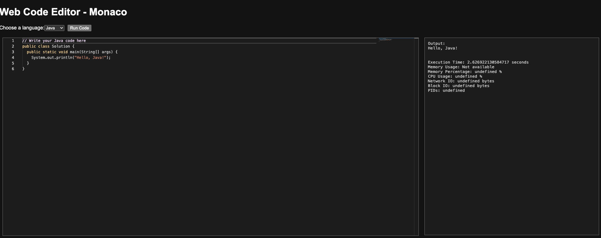
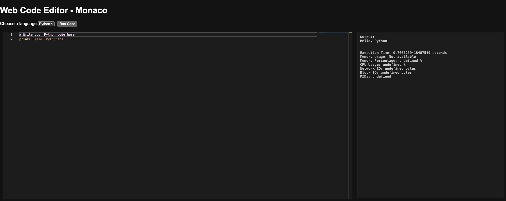

# CodeSandbox

A development environment containing a web-based code editor and a Flask backend for executing code snippets. This project integrates a Monaco editor for code editing and a Flask application for running and analyzing code in Python and Java. Docker is used for isolated execution environments. 

The development of the code editor was done for study purposes only. The code is still in developmental phases. I have developed this code to help coach myself to practice for interviews (specifically whiteboarding). The code editor though has inbuilt support for auto complete and suggestions. 




## Project Structure

- **monaco-editor/**: Contains the web-based code editor setup using the Monaco editor.
- **Flask/**: Contains the Flask application for executing Python and Java code snippets in Docker containers.

## Features

- **Web-Based Code Editor**: Uses Monaco Editor for editing code with syntax highlighting and other features.
- **Code Execution**: Flask backend executes Python and Java code snippets.
- **Docker Integration**: Runs code in isolated Docker containers for security and resource management.
- **Execution Metrics**: Provides detailed metrics including execution time, memory usage, CPU usage, and more.

## Getting Started

### Prerequisites

- Docker: Ensure Docker is installed and running on your machine.
- Python: Python 3.6 or later.
- Flask: Install Flask and Flask-CORS.
- Monaco Editor: The code editor is set up via CDN.

### Setup

1. **Clone the Repository**

    ```bash
    git clone https://github.com/suyashshetty/codesandbox.git
    cd codesandbox
    ```

2. **Install Dependencies**

    Navigate to the `Flask` directory and install the necessary Python packages.

    ```bash
    cd Flask
    pip install -r requirements.txt
    ```

3. **Run the Flask Server**

    Start the Flask server.

    ```bash
    python flask_app.py
    ```

4. **Run the HTTP Server**

    Navigate to the `monaco-editor` directory and use a simple HTTP server to serve the code editor files. If you have Python 3.x installed, you can use the following command:

    ```bash
    cd ../monaco-editor
    python -m http.server 8000
    ```

5. **Access the Code Editor**

    Open your web browser and go to:

    ```plaintext
    http://localhost:8000
    ```

    This will load the Monaco editor where you can write and execute code.

### Running Code

1. Write or paste your code into the Monaco editor.
2. Select the programming language (Python or Java) from the dropdown.
3. Click the "Run Code" button to execute the code.
4. View the output and execution metrics in the output panel.

### Contributing

Contributions are welcome! Please raise an issue or submit a pull request for any improvements or bug fixes.

### License

This project is licensed under the MIT License - see the [LICENSE](LICENSE) file for details.

## Contact

For any questions or suggestions, please raise an issue on the [GitHub Issues](https://github.com/suyashshetty/codesandbox/issues) page.
